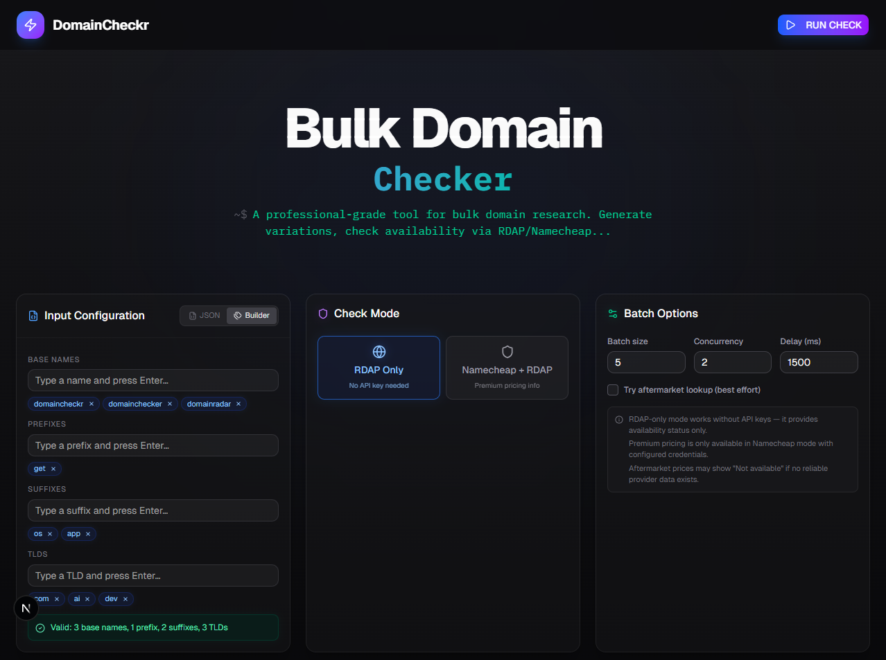

# DomainCheckr

A local utility for **bulk domain name availability research** for product naming. Generates all meaningful domain combinations from base names, prefixes, suffixes, and TLDs — then checks availability progressively.



## Quick Start

```bash
npm install
npm run dev
```

Open [http://localhost:3000](http://localhost:3000).

## Two Modes

### Mode A: RDAP Only (default)
- **No API key needed** — works immediately
- Checks domain registration via the public RDAP protocol
- Provides: available / registered / unknown status
- Does **not** provide premium pricing or aftermarket data

### Mode B: Namecheap + RDAP Fallback
- Requires Namecheap API credentials (see below)
- Uses Namecheap as primary provider for availability + pricing
- Falls back to RDAP if Namecheap fails for a domain
- Provides: premium registration prices, standard TLD pricing

## Adding Namecheap Credentials

1. Copy `.env.example` to `.env.local`
2. Fill in your Namecheap API credentials:

```env
NAMECHEAP_API_USER=your_api_user
NAMECHEAP_API_KEY=your_api_key
NAMECHEAP_USERNAME=your_username
NAMECHEAP_CLIENT_IP=your_whitelisted_ip
```

3. Restart the dev server
4. Select "Namecheap + RDAP" mode in the UI

Get API credentials at [namecheap.com/support/api/intro](https://www.namecheap.com/support/api/intro/).

## Input JSON Format

Upload or paste a JSON file like:

```json
{
  "base_names": ["kivo", "vestra", "sengo"],
  "prefixes": ["get", "try"],
  "suffixes": ["app", "lab"],
  "tlds": ["com", "ai", "dev"]
}
```

## Combination Generation

Given `base_names`, `prefixes`, `suffixes`, the generator produces:

| Pattern | Example |
|---|---|
| `base` | `kivo` |
| `prefix + base` | `getkivo` |
| `base + suffix` | `kivoapp` |
| `prefix + base + suffix` | `getkivoapp` |

Each label is combined with each TLD → `kivo.com`, `getkivo.ai`, etc.

All labels are lowercased, trimmed, and deduplicated.

## Batch Processing

Domains are processed in controlled batches to avoid rate limiting (HTTP 429):

- **Batch size**: how many domains per batch (default: 5)
- **Concurrency**: parallel requests within a batch (default: 2)
- **Delay**: pause between batches in ms (default: 1500)
- Automatic retry with exponential backoff
- Respects `Retry-After` headers
- Cancel button to stop mid-run

Results appear progressively as each batch completes.

## Extending Aftermarket Providers

The codebase includes an `AftermarketProvider` interface in `src/lib/providers/provider.ts`. To add a new aftermarket source:

1. Implement the `AftermarketProvider` interface
2. Wire it into the batch processor
3. The result schema already supports `aftermarketResalePrice` and `aftermarketSource`

## Project Structure

```
src/
├── app/
│   ├── api/
│   │   ├── check/route.ts    # Streaming NDJSON endpoint
│   │   └── config/route.ts   # Config check endpoint
│   ├── globals.css
│   ├── layout.tsx
│   └── page.tsx               # Main UI
├── components/
│   ├── ui/                    # shadcn/ui components
│   ├── json-input.tsx
│   ├── mode-selector.tsx
│   ├── options-panel.tsx
│   ├── progress-panel.tsx
│   ├── results-table.tsx
│   └── summary-cards.tsx
└── lib/
    ├── providers/
    │   ├── provider.ts         # Interfaces
    │   ├── rdap-provider.ts
    │   └── namecheap-provider.ts
    ├── batch-processor.ts
    ├── domain-generator.ts
    ├── schemas.ts
    ├── types.ts
    └── utils.ts
```

## What works right now without API keys

- RDAP-only domain availability checking
- Full combination generation from JSON input
- Progressive batch processing with live progress
- Results table with sorting, filtering, search
- Export to JSON/CSV
- Cancel running checks

## What gets unlocked with Namecheap later

- Premium domain detection and pricing
- Standard TLD registration pricing
- More reliable availability detection for some TLDs
- Hybrid mode with automatic RDAP fallback

## Known Limitations

- RDAP may rate-limit under heavy usage
- Some TLDs may not have RDAP support (results show as "unknown")
- Aftermarket prices are not currently populated (extension point exists)
- No database — results are in-memory only

## Future Improvements

- Add aftermarket providers (e.g., Afternic, Sedo)
- Persist results across sessions (SQLite or file-based)
- Add separator options (hyphens, dots) in label generation
- Whois fallback for TLDs without RDAP support
- Bulk export of available domains only
- History of previous runs
